# Architecture — Mission Readiness & Predictive Maintenance Copilot

## System Architecture

The **Mission Readiness & Predictive Maintenance Copilot (AEGIS Defense Platform)** is designed with a decoupled, high-performance architecture optimized for high-concurrency sensor ingestion, deterministic machine learning inference, and low-latency LLM agent reasoning.

```mermaid
graph TD
    subgraph Client ["Frontend Presentation Layer (React 19 + Vite)"]
        UI_Dash["Tactical Dashboard & Gauges"]
        UI_Fleet["Fleet Readiness Overview"]
        UI_Detail["Asset Telemetry & XAI Inspector"]
        UI_Chat["Copilot Chat Console (Floating / Full)"]
        UI_Batch["Batch Telemetry Uploader"]
        UI_Orders["Work Orders & Maintenance Dispatch"]
    end

    subgraph Gateway ["API & Communication Gateway (FastAPI)"]
        REST_Assets["/api/assets & /api/metrics"]
        REST_Predict["/api/predict/* (Single Inferences)"]
        REST_Batch["/api/upload-csv & /api/batch-runs"]
        REST_Chat["/api/chat & /api/chat/*"]
        WS_Telemetry["WebSocket: /api/ws/telemetry"]
        WS_Worker["Async Background Telemetry Streamer"]
    end

    subgraph Intelligence ["AI & Machine Learning Engine"]
        ML_Registry["ML Model Registry (predictor.py)"]
        M1["NASA IMS Bearing Model (bearing.pkl)"]
        M2["AI4I 2020 Armor Model (ai4i.pkl)"]
        M3["NASA N-CMAPSS Turbofan (failure_model.pkl)"]
        XAI["XAI Attribution Engine (explainer.py)"]
    end

    subgraph LLM_Agent ["Autonomous Copilot Reasoner"]
        Agent_Router["Copilot Orchestrator (routes_chat.py)"]
        Groq_LPU["Groq LPU Engine (Llama 3.3 70B Versatile)"]
        Gemini_Fallback["Gemini API Fallback"]
        Local_RAG["Rule-Grounded Defense RAG"]
        Tool_Dispatch["Autonomous Work Order Tool"]
    end

    subgraph Storage ["Persistence & Telemetry Datastore"]
        DB[(SQLite: defense_telemetry.db)]
        T_Assets["custom_assets table"]
        T_Batches["telemetry_batches table"]
        T_Orders["work_orders table"]
        Disk_Uploads["data/uploads/ & data/scored_batches/"]
    end

    %% Client to Gateway connections
    UI_Dash -->|REST GET /api/assets| REST_Assets
    UI_Detail -->|REST GET /api/assets/:id| REST_Assets
    UI_Detail -->|WS Telemetry Feed| WS_Telemetry
    UI_Chat -->|REST POST /api/chat| REST_Chat
    UI_Batch -->|Multipart POST /api/upload-csv| REST_Batch
    UI_Orders -->|REST GET & POST /api/work-orders| REST_Assets

    %% Gateway to ML & Worker
    WS_Worker -->|Pushes Real-time Sensor Drift| WS_Telemetry
    REST_Predict --> ML_Registry
    REST_Batch --> ML_Registry
    REST_Assets --> ML_Registry
    ML_Registry --> M1
    ML_Registry --> M2
    ML_Registry --> M3
    REST_Assets --> XAI

    %% Copilot Orchestration
    REST_Chat --> Agent_Router
    Agent_Router --> Groq_LPU
    Agent_Router -.->|Fallback| Gemini_Fallback
    Agent_Router -.->|Air-gapped| Local_RAG
    Agent_Router --> Tool_Dispatch
    Tool_Dispatch -->|Auto Commit Order| T_Orders

    %% Storage connections
    REST_Assets <--> DB
    REST_Batch <--> DB
    REST_Batch --> Disk_Uploads
    DB --- T_Assets
    DB --- T_Batches
    DB --- T_Orders
```

---

## Components

| Component | Technology | Responsibility |
|---|---|---|
| **Frontend Web Client** | React 19, Vite, Lucide React, Tailwind / Glassmorphism CSS | High-fidelity tactical defense interface, live asset gauges, interactive vibration/pressure charts, fleet status filters, and instant Copilot chat panel. |
| **Backend API Gateway** | Python 3.11+, FastAPI, Uvicorn, Pydantic v2 | High-throughput async REST API handling asset metadata, batch telemetry uploads, work orders, and prediction endpoints. |
| **Telemetry Streaming Engine** | FastAPI WebSockets, asyncio background tasks | Continuously broadcasts multi-channel sensor telemetry at 1-second intervals; handles dynamic anomaly injection and test fault injection. |
| **ML Model Registry** | scikit-learn, joblib, NumPy, pandas | Houses three specialized models (`bearing.pkl`, `ai4i.pkl`, `failure_model.pkl`) to run sub-millisecond single inferences and vectorized 5,000-row batch inferences. |
| **Explainable AI (XAI) Engine** | Custom XAI feature attribution (`ml/explainer.py`) | Computes exact mathematical contribution percentages for abnormal sensor dimensions (RMS, Kurtosis, Tool Wear, Temps), demystifying black-box ML outputs. |
| **Autonomous Copilot Agent** | Groq LPU (Llama 3.3 70B), Gemini API, Defense Domain Prompt Engine | Translates technical telemetry and XAI weights into operational insights in English and Hinglish; executes autonomous tool actions like work order creation. |
| **Telemetry Datastore** | SQLite (`src/backend/data/defense_telemetry.db`), File Storage | Lightweight, zero-configuration edge datastore storing registered assets, batch scoring runs, work orders, and historical sensor logs. |

---

## Data Flow

### 1. Live Real-Time Telemetry Stream & Anomaly Detection
1. The client establishes a WebSocket connection to `ws://localhost:8000/api/ws/telemetry`.
2. The backend async worker generates continuous telemetry packets (vibration, hydraulic pressure, bearing temperature) simulating real-world HUMS sensors.
3. If an anomaly occurs (or is triggered via `/api/ws/inject-anomaly`), the worker marks the packet with `isSpike: true` and elevated severity.
4. The React dashboard reflects the spike instantly on the live radial gauges and alerts feed.

### 2. High-Throughput Batch Telemetry Ingestion
1. The operator uploads a multi-thousand-row CSV via the `/upload` dashboard or API (`POST /api/upload-csv`).
2. The backend ingests the file into memory using `pandas.read_csv`.
3. The ML Model Registry automatically detects feature columns (or accepts an explicit `model_type` flag) and executes vectorized inference across all rows in parallel using NumPy matrix operations.
4. The system calculates failure probabilities, readiness scores, and predicted RULs, appending them to the dataset.
5. Raw and scored CSV files are persisted to `data/uploads/` and `data/scored_batches/`, and summary metrics are recorded in SQLite.

### 3. Explainable AI (XAI) Feature Attribution
1. When viewing an asset (e.g., Su-30MKI `A-317`), the client requests `GET /api/assets/A-317/explanation`.
2. The XAI engine evaluates the current sensor vector against operational baseline bounds.
3. Feature attribution weights are computed (e.g., *Peak Vibration: 48%, Kurtosis: 31%, Pressure: 21%*).
4. Results are displayed as an interactive attribution bar chart in the Asset Detail view, providing complete auditability for defense engineers.

### 4. Copilot Conversational Reasoning & Autonomous Work Orders
1. The user asks a question in English or Hinglish: *"A-317 ka issue check karo aur high priority work order dispatch karo"*.
2. `routes_chat.py` receives the prompt, checks if an asset is currently in scope, retrieves live asset telemetry and service records, and formulates a grounded system prompt.
3. The prompt is sent to the Groq LPU running `llama-3.3-70b-versatile` (or fallback engine).
4. If an actionable intent is detected, the Copilot calls `save_work_order` to persist a maintenance order in SQLite.
5. The Copilot returns a formatted natural-language explanation alongside the newly minted Work Order ticket (`WO-A317-XXX`).

---

## Security Considerations

- **Air-Gapped Forward Deployment Readiness:** The backend is architected to operate fully without internet access using local ML models (`.pkl`) and the built-in deterministic Defense RAG engine, ensuring zero external data leakage in classified environments.
- **Environment Variable Isolation:** External API credentials (`GROQ_API_KEY`, `GEMINI_API_KEY`) are managed strictly through `.env` and never committed to version control.
- **Strict Input Validation & Parsing:** All incoming REST and WebSocket payloads are validated against strict Pydantic v2 schemas (`ChatRequest`, `BearingPredictRequest`, `ArmorPredictRequest`), preventing injection attacks.
- **CORS Hardening:** Cross-Origin Resource Sharing is configurable in `main.py` to restrict access strictly to authorized tactical client origins in production.
- **Database Safety:** SQLite access utilizes parameterized SQL queries across all functions in `database.py`, preventing SQL injection.

---

## Scalability Notes

- **Vectorized ML Scoring:** Single-threaded Python bottlenecks are avoided by using vectorized NumPy/scikit-learn matrix calculations, enabling sub-second scoring of 50,000+ sensor rows on standard commodity hardware.
- **Stateless REST Services:** The FastAPI application layer is completely stateless and can be containerized and scaled horizontally across multiple Uvicorn worker processes behind an NGINX or Traefik reverse proxy.
- **WebSocket Scaling with Redis Pub/Sub:** For large-scale defense deployments with thousands of concurrent base terminals, the in-memory WebSocket manager can be backed by a Redis Pub/Sub layer.
- **Database Migration Path:** SQLite serves as the zero-overhead default for tactical laptops and FOB deployments; the schema and queries are fully standard SQL and can be migrated to enterprise PostgreSQL / IBM Db2 with zero application code changes.
