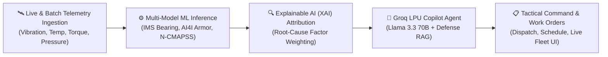

# Solution Overview

## What We Built

We built the **Mission Readiness & Predictive Maintenance Copilot (AEGIS Defense Platform)** — an end-to-end AI-powered defense command and engineering intelligence system designed to ensure maximum combat readiness and zero unpredicted mission failures across multi-domain military fleets.

The platform continuously monitors telemetry from combat aircraft, armored ground vehicles, rotary wings, and naval platforms, applying **three domain-specialized Machine Learning models** to calculate asset readiness scores and predict Remaining Useful Life (RUL) in days. 

Sitting on top of the predictive models is an **autonomous AI Copilot** (powered by Groq LPU with Llama 3.3 70B and local defense RAG) that bridges the gap between complex sensor telemetry and tactical decision-making. Maintenance crews and base commanders can converse with the Copilot in plain English or operational Hinglish to interrogate fleet status, pinpoint physical root causes via **Explainable AI (XAI)**, simulate sensor stress tests, and autonomously generate and dispatch prioritized maintenance work orders into an integrated SQLite telemetry database.

## How It Works

The platform operates across five interconnected stages:



1. **Continuous Telemetry Streaming & Ingestion:**
   - Real-time sensor streams (vibration RMS, kurtosis, peak frequency, hydraulic pressure, engine temps, tool wear, torque) flow into the backend via asynchronous WebSockets (`/api/ws/telemetry`).
   - High-throughput CSV batch ingestion (`/api/upload-csv`) parses and scores 5,000+ telemetry rows in under 1 second using vectorized NumPy and Pandas pipelines.
2. **Domain-Specific Machine Learning Inference:**
   - **Rotary & Aviation Bearing Model (`bearing.pkl`):** Trained on NASA IMS Bearing vibration data to detect spalling and inner/outer race fatigue.
   - **Ground Armor & Combat Vehicle Model (`ai4i.pkl`):** Trained on AI4I 2020 Predictive Maintenance data to detect heat dissipation failures, power failures, and tool/component wear on heavy armor (Arjun Mk-II, T-90, UGVs).
   - **Turbofan Engine Failure Model (`failure_model.pkl`):** Trained on NASA N-CMAPSS turbofan run-to-failure degradation sequences to compute precise Remaining Useful Life (RUL).
3. **Explainable AI (XAI) Feature Attribution:**
   - Rather than acting as a black box, the XAI engine calculates exact percentage contributions for anomalous sensor readings (e.g., *Peak Vibration +48% contribution, Kurtosis +31% contribution*), pinpointing the exact physical degradation mechanism.
4. **Autonomous Copilot Intelligence (Groq LPU / Llama 3.3 70B):**
   - Maintenance staff or commanders query the fleet via natural language (e.g., *"Su-30 A-317 ka vibration kyu spike ho raha hai?"* or *"List all assets not mission-ready for a 72-hour exercise"*).
   - The Copilot reasons over structured telemetry, applies rule-grounded defense RAG, and produces concise tactical assessments with recommended parts and labor time.
5. **Action Plan & Work Order Dispatch:**
   - The Copilot can autonomously formulate and commit maintenance work orders directly into the database, assigning technician squads, priority levels (CRITICAL, HIGH, MEDIUM), due windows, and parts requirements.

## Architecture Summary

```
┌───────────────────────────────────────────────────────────┐
│                      TACTICAL CLIENT                      │
│   React 19 + Vite + Lucide Icons + Real-Time Gauges       │
│  (Dashboard, Fleet View, Asset Detail, Live Chat, Plans)  │
└─────────────────────────────┬─────────────────────────────┘
                              │ HTTP REST + WebSockets (WS)
┌─────────────────────────────▼─────────────────────────────┐
│                   FASTAPI BACKEND ENGINE                  │
│  ┌───────────────────────┐     ┌───────────────────────┐  │
│  │   Telemetry Streamer  │     │   Predictive Router   │  │
│  │   & Anomaly Injector  │     │   (Single & Batch)    │  │
│  └──────────┬────────────┘     └──────────┬────────────┘  │
│             │                             │               │
│  ┌──────────▼────────────┐     ┌──────────▼────────────┐  │
│  │     ML Model Hub      │     │  Explainable AI (XAI) │  │
│  │ (IMS, AI4I, N-CMAPSS) │     │  Attribution Engine   │  │
│  └──────────┬────────────┘     └──────────┬────────────┘  │
│             │                             │               │
│  ┌──────────▼─────────────────────────────▼────────────┐  │
│  │            Copilot Agent Orchestrator               │  │
│  │   (Groq LPU Llama 3.3 70B / Gemini / Defense RAG)   │  │
│  └──────────────────────────┬──────────────────────────┘  │
└─────────────────────────────┼─────────────────────────────┘
                              │
┌─────────────────────────────▼─────────────────────────────┐
│                 PERSISTENT STORAGE & DATA                 │
│        SQLite Database (defense_telemetry.db)             │
│   - custom_assets       - telemetry_batches               │
│   - work_orders         - historical sensor logs          │
└───────────────────────────────────────────────────────────┘
```

> See [`architecture.md`](architecture.md) for the detailed technical blueprint and network sequence.

## Key Design Decisions

| Decision | Rationale |
|---|---|
| **Multi-Model Specialized ML Architecture** | Combat aircraft turbofans, helicopter rotary transmissions, and tracked battle tanks experience completely different mechanical wear dynamics. Using separate trained models (NASA IMS, AI4I 2020, N-CMAPSS) provides far higher predictive accuracy than a one-size-fits-all model. |
| **Separation of ML Predictor and LLM Reasoner** | Numerical regression and failure classification are strictly handled by deterministic scikit-learn models. The LLM is used exclusively for contextual reasoning, natural language translation, tactical explanation, and workflow automation, preventing LLM hallucinations in mission-critical numbers. |
| **Bilingual Defense Domain Support (English & Hinglish)** | Field operators, base mechanics, and Indian defense technicians frequently communicate in mixed Hindi-English operational parlance. Grounding the Copilot to understand colloquial maintenance vernacular ensures seamless adoption in real-world military depots. |
| **Dual-Mode Telemetry (Real-Time WebSockets + Bulk Batch Upload)** | Operational bases need live per-second cockpit telemetry monitoring while depot maintenance facilities require batch ingestion of historical CSV logs from black-box recorders. Supporting both satisfies the full operational lifecycle. |
| **Embedded SQLite Architecture for Edge & Forward Operating Bases** | SQLite eliminates the operational overhead and vulnerability of external cloud database dependencies, allowing the system to run in air-gapped, tactically deployed field laptops or ruggedized base servers without external connectivity. |

## AI & Enterprise Technologies Used

- **Groq LPU Inference (Llama 3.3 70B Versatile):** Serves ultra-low latency (<300ms) conversational inferences, parsing complex telemetry payloads into conversational military summaries and action plans.
- **Explainable AI (XAI) Attribution Engine:** Computes exact percentage contributions of abnormal sensor values to ensure compliance with military verification standards and transparent maintenance audits.
- **FastAPI & Asynchronous WebSockets:** Delivers high-concurrency real-time sensor streams (60 FPS gauge updates) and sub-second REST responses for batch scoring runs.
- **scikit-learn & Joblib:** Powers the pre-trained failure classification and RUL regression models with deterministic feature vector transformations.
- **React 19 & Vite:** Delivers an ultra-responsive, cyber-defense-themed dark mode user experience with interactive telemetry charts, live gauges, and instant Copilot messaging.
